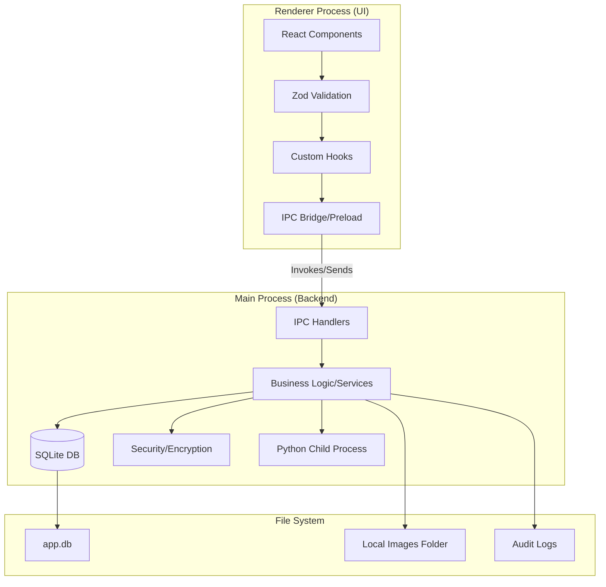

# 🚀 Planejamento de Migração: Laudo Pericial

### 🐍 Python/Streamlit ➔ ⚛️ Electron + React

## 📈 **STATUS ATUAL DO PROJETO** (12/05/2026 - atualizado)

### ✅ **SPRINT 0: COMPLETA**

- **Infraestrutura:** Electron + Vite + TypeScript funcionando
- **Banco de Dados:** SQLite com schema inicial (8 tabelas base; hoje 9 após migrations v1→v9)
- **Segurança:** Criptografia AES-256-GCM + bcrypt implementada
- **Tratamento de Erros:** ErrorBoundary React com 4 opções de recuperação
- **Comunicação:** IPC bridge segura e tipada implementada

### ✅ **SPRINT 1: COMPLETA**

- **Validação:** Schemas Zod para todas as entidades
- **UI:** Componentes Shadcn/ui configurados
- **Serviços:** 8 serviços de negócio implementados

### ✅ **SPRINT 2: COMPLETA**

- **Páginas:** Dashboard, Perfil, Solicitantes, TiposExame
- **Tema:** Dark/light com persistência
- **Menu:** Sidebar colapsável com seções agrupadas

### ✅ **SPRINT 3: COMPLETA**

- **REPs:** CRUD completo com formulário inline e campos condicionais
- **Migration v9** aplicada

### ✅ **SPRINT 4: PARCIAL (85%)**

- **Cabeçalho:** Página com editor HTML e placeholders implementada (antecipado)
- **LaudosPage:** Editor multi-seção TinyMCE implementado
- **TinyMCE:** 14 plugins, toolbar 2 linhas, modo floating responsivo
- **Upload de imagens:** Diálogo nativo + protocolo `laudo-img://` + serviço/handlers
- **IA:** Integração total com Groq no editor para revisão e chat assistente
- **Pendente:** Painel lateral de imagens, drag-and-drop, snapshots
- **Destaque:** Resolução dinâmica de placeholders no texto do laudo antes de chamar a IA e inserção precisa da resposta na posição do cursor do perito.

### ✅ **SPRINT 5: COMPLETA**

- **Placeholders:** CRUD completo, 22 do sistema, sintaxe `{{chave}}`

### ✅ **SPRINT 6: COMPLETA**

- **IA:** ModelosIAPage, integração Groq, handlers de IA, assistente interativo (`AISheet`), aprovação obrigatória do usuário para aplicar alterações de Ortografia/Adequar (fim da substituição silenciosa), suporte de visão para imagens locais (`laudo-img://`) e migração para o modelo ativo Llama 4 Scout.

### ✅ **SPRINT 8: COMPLETA**

- **Backup:** BackupPage, serviço de backup ZIP, restauração completa
- **Logs:** LogsPage, auditoria visual, gestão de logs estruturados

---

Este documento detalha o roadmap estratégico para a migração do sistema "Laudo Pericial" para uma arquitetura desktop robusta. O planejamento é dividido em sprints incrementais, priorizando a fundação técnica e a segurança antes das funcionalidades de negócio.

Em caso de consulta do projeto em python + streamlit, acesse o diretorio laudo-streamlit na raiz deste projeto.

---

## 📋 Sumário

- [🔄 Ciclo de Vida e Estados](#-ciclo-de-vida-e-estados)
- [🛠️ Stack Tecnológico](#️-stack-tecnológico)
- [🏗️ Arquitetura e Estrutura](#️-arquitetura-e-estrutura)
- [🎨 Design System](#-design-system)
- [🖼️ Gestão de Imagens](#️-gestão-de-imagens)
- [📅 Roadmap de Sprints](#-roadmap-de-sprints)
  - [Sprint 0: Fundação & Segurança](#sprint-0-fundação-segurança-e-infraestrutura-crítica)
  - [Sprint 1: Arquitetura Base](#sprint-1-fundação-e-arquitetura-base)
  - [Sprint 2: Cadastros Estruturais](#sprint-2-perfil-do-perito-e-cadastros-estruturais-de-apoio-com-shadcnui)
  - [Sprint 3: Gestão de REPs](#sprint-3-gestão-de-requisições-rep-com-shadcnui)
  - [Sprint 4: Edição de Laudos](#sprint-4-núcleo-do-sistema---edição-de-laudos-com-imagens-e-legendas)
  - [Sprint 5: Placeholders](#sprint-5-motor-de-placeholders-e-dinamismo)
  - [Sprint 6: Assistência IA](#sprint-6-assistência-inteligente-ia---opcional-e-configurável)
  - [Sprint 7: Exportação](#sprint-7-exportação-e-documento-final)
  - [Sprint 8: Auditoria & Backup](#sprint-8-histórico-auditoria-e-backuprestauração)
  - [Sprint 9: Performance](#sprint-9-otimização-de-performance-e-experiência-do-usuário)
  - [Sprint 10: Distribuição](#sprint-10-utilidades-polimento-final-e-distribuição)

---

## 🔄 Ciclo de Vida e Estados

> [!NOTE]
> O ciclo de vida base governa as regras de transição de dados entre os módulos de requisição e laudo.

| Entidade  | Status Disponíveis                      | Observação                                    |
| :-------- | :-------------------------------------- | :-------------------------------------------- |
| **REP**   | `Pendente`, `Em Andamento`, `Concluído` | Requisição de Exame Pericial                  |
| **Laudo** | `Em andamento`, `Concluído`, `Entregue` | "Nasce" como `Em andamento` ao vincular à REP |

---

## 🛠️ Stack Tecnológico

| Camada               | Tecnologia                                                                | Descrição                                 |
| :------------------- | :------------------------------------------------------------------------ | :---------------------------------------- |
| **Runtime Desktop**  | [Electron](https://www.electronjs.org/)                                   | Container para aplicação desktop          |
| **Build Tool**       | [Vite](https://vitejs.dev/)                                               | Bundler ultrarrápido com HMR              |
| **Linguagem**        | [TypeScript](https://www.typescriptlang.org/)                             | Tipagem estática para robustez            |
| **Frontend**         | [React](https://react.dev/)                                               | Biblioteca de UI declarativa              |
| **Backend (Main)**   | [Node.js](https://nodejs.org/)                                            | Processo principal do Electron            |
| **Banco de Dados**   | [SQLite](https://www.sqlite.org/)                                         | Armazenamento local leve e confiável      |
| **UI Components**    | [Shadcn/ui](https://ui.shadcn.com/)                                       | Componentes acessíveis com Tailwind CSS   |
| **Editor Rich Text** | [TinyMCE](https://www.tinymce.com/)                                       | Editor de texto robusto para laudos       |
| **Validação**        | [Zod](https://zod.dev/) + [React Hook Form](https://react-hook-form.com/) | Esquemas de dados e gestão de formulários |
| **Logging**          | [Winston](https://github.com/winstonjs/winston)                           | Logs estruturados com rotação automática  |
| **Criptografia**     | Node.js `crypto` + `bcrypt`                                               | AES-256-GCM + PBKDF2 para dados sensíveis |

---

## 🏗️ Arquitetura e Estrutura

### 🗺️ Fluxo de Comunicação (IPC)



### 📁 Estrutura de Diretórios (ATUAL)

```text
laudopericial/ (raiz do projeto)
├── src/
│   ├── main/                    # ✅ Electron Main Process (Backend)
│   │   ├── database/            # ✅ SQLite com schema v9 + migrations
│   │   ├── ipc/                 # ✅ Handlers IPC (8 módulos)
│   │   │   └── handlers/        # ✅ user, solicitante, tipo-exame, configuracao, rep, placeholder, template, laudo, imagem
│   │   ├── security/            # ✅ Criptografia, Sanitização e Validação
│   │   ├── services/            # ✅ 8 serviços de negócio implementados
│   │   │   ├── base.service.ts
│   │   │   ├── user.service.ts
│   │   │   ├── solicitante.service.ts
│   │   │   ├── tipo-exame.service.ts
│   │   │   ├── configuracao.service.ts
│   │   │   ├── rep.service.ts
│   │   │   ├── placeholder.service.ts
│   │   │   ├── template.service.ts
│   │   │   ├── laudo.service.ts
│   │   │   ├── imagem.service.ts
│   │   │   └── backup.service.ts
│   │   └── utils/               # ✅ Helpers globais (logger, etc.)
│   ├── preload/                 # ✅ Bridge IPC segura (Context Bridge)
│   ├── renderer/                # ✅ Frontend React (11 páginas)
│   │   ├── components/          # ✅ ErrorBoundary, layout, shadcn/ui
│   │   ├── pages/               # ✅ 11 páginas implementadas
│   │   │   ├── AuthPage.tsx
│   │   │   ├── DashboardPage.tsx
│   │   │   ├── PerfilPage.tsx
│   │   │   ├── SolicitantesPage.tsx
│   │   │   ├── TiposExamePage.tsx
│   │   │   ├── CabecalhoPage.tsx
│   │   │   ├── REPsPage.tsx
│   │   │   ├── PlaceholdersPage.tsx
│   │   │   ├── TemplatesPage.tsx
│   │   │   ├── ModelosIAPage.tsx
│   │   │   ├── LaudosPage.tsx
│   │   │   ├── BackupPage.tsx
│   │   │   └── LogsPage.tsx
│   │   ├── hooks/               # ✅ Custom hooks
│   │   ├── lib/                 # ✅ Schemas Zod e validações
│   │   └── styles/              # ✅ CSS Global, Tailwind, dark mode
│   └── shared/                  # ✅ Types, Interfaces e Constantes
├── migracao/                    # ✅ Documentação do projeto
├── laudo-streamlit/             # ✅ Projeto legado para referência
├── package.json                 # ✅ Dependências configuradas
├── vite.config.ts               # ✅ Build pipeline Vite
└── electron-builder.yml         # ⬜ Configurações de empacotamento (futuro)
```

---

## 🎨 Design System

> [!TIP]
> O uso do **Shadcn/ui** garante uma interface moderna e profissional ("Premium Design") com pouco esforço de estilo customizado.

### Componentes Chave:

- **Form/Input/Select**: Para cadastros técnicos rigorosos.
- **Table/Badge**: Para dashboard de REPs e status.
- **Dialog/AlertDialog**: Para confirmações críticas e inserção de imagens.
- **Tabs**: Para separar seções do laudo e configurações.

---

## 🖼️ Gestão de Imagens

### 📄 Modelo de Dados

```typescript
interface ImagemLaudo {
  id: string;
  laudo_id: string;
  caminho: string; // public/images/laudo_123_img_001.jpg
  legenda: string; // "Figura X: descrição"
  numero_figura: number; // 1, 2, 3... (auto-incrementado)
  sequencia: number; // Ordem de exibição manual
  gps?: { latitude: number; longitude: number };
  dataCaptura: Date;
}
```

### 🛠️ Fluxo de Inserção

1. **Manual (TinyMCE)**: Diálogo modal para upload + legenda instantânea.
2. **Automática (Side Panel)**: Painel com Cards, reordenação via Drag-and-Drop e geração automática de seção "Figuras" ao final.

---

## 📅 Roadmap de Sprints

### 🏗️ Sprint 0: Fundação, Segurança e Infraestrutura Crítica ✅ **COMPLETADA**

**Objetivo:** Garantir a base sólida antes de qualquer interface funcional. **CONCLUÍDO**

**✅ IMPLEMENTAÇÕES COMPLETAS:**

#### 1. **Infraestrutura Electron + Vite + TypeScript**

- [x] Projeto configurado na raiz do repositório
- [x] Build system completo (Vite + TypeScript + Electron)
- [x] Ambiente de desenvolvimento funcional (`npm run dev`)

#### 2. **Banco de Dados SQLite Avançado**

- [x] Driver SQLite3 nativo no main process
- [x] **Schema completo com 8 tabelas:**
  - `users` (peritos)
  - `solicitantes` (órgãos/varas)
  - `tipos_exame` (categorias de perícia)
  - `reps` (Requisições de Exame Pericial)
  - `laudos` (documentos técnicos)
  - `imagens_laudo` (fotos e ilustrações)
  - `placeholders` (tags dinâmicas)
  - `logs_auditoria` (histórico de ações)
- [x] **Sistema de versionamento** com migrations automáticas
- [x] **Transações ACID** (BEGIN, COMMIT, ROLLBACK)
- [x] **Backup/restauração** automática
- [x] **Índices otimizados** para performance

#### 3. **Segurança de Alto Nível**

- [x] **Criptografia AES-256-GCM** com PBKDF2 para dados sensíveis
- [x] **Hash bcrypt** para senhas (salt rounds = 10)
- [x] **Content Security Policy (CSP)** configurada
- [x] **Validação e sanitização** de entrada completa
- [x] **Proteção contra SQL Injection** com prepared statements
- [x] **Headers de segurança** (X-Content-Type-Options, X-Frame-Options, etc.)
- [x] **Sanitização de queries** perigosas (DROP, DELETE, etc.)

#### 4. **Tratamento de Erros Profissional**

- [x] **ErrorBoundary React** com UI amigável
- [x] **4 opções de recuperação:**
  - Reiniciar aplicação
  - Voltar para início
  - Limpar cache
  - Reportar erro via email
- [x] **Logs estruturais** com Winston (rotação de 5MB)
- [x] Captura de erros não tratados (uncaughtException)

#### 5. **Arquitetura Comunicação IPC**

- [x] **Bridge IPC tipada** entre main/renderer
- [x] **Handlers para:**
  - Utilitários (ping, app info)
  - Logs (info, error, warning)
  - Sistema (restart, devtools, close)
  - Banco de dados (query, backup, restore)
  - Autenticação (login, logout, session)
- [x] **Separação clara** de responsabilidades

#### 6. **Interface React Funcional**

- [x] **Dashboard** com layout profissional
- [x] **Sidebar navigation** com itens principais
- [x] **Integration** com sistema IPC
- [x] **Status monitoring** em tempo real

---

### 🧱 Sprint 1: Arquitetura Base ✅ **COMPLETADA**

**Objetivo:** Estabelecer os padrões de desenvolvimento e validação sobre a fundação sólida.

**✅ IMPLEMENTADO:**

- [x] Validar schema inicial (8 tabelas completas com índices).
- [x] Estabelecer padrão de **IPC Tipado** para segurança total na comunicação.
- [x] Implementar prepared statements contra SQL Injection.
- [x] Criar handlers de "Health Check" do sistema (ping, app info).

**🔄 PRÓXIMAS TAREFAS PARA SPRINT 1 (CONCLUÍDAS):**

#### 1. **Validação com Zod** ✅

- [x] Criar schemas Zod para todas as entidades:
  - Usuário (perito)
  - Solicitante
  - Tipo de Exame
  - REP (Requisição de Exame Pericial)
  - Laudo
  - Imagem de Laudo
  - Placeholder
  - Log de Auditoria

#### 2. **Handlers IPC Específicos** ✅

- [x] Implementar operações CRUD completas via IPC:
  - CRUD de Usuários
  - CRUD de Solicitantes
  - CRUD de Tipos de Exame
  - CRUD de REPs
  - CRUD de Configurações (Cabeçalho)
  - CRUD de Placeholders
  - CRUD de Laudos (futuro)
  - CRUD de Imagens (futuro)

#### 3. **Serviços de Negócio** ✅

- [x] Criar serviços para lógica complexa:
  - Gerenciamento de status de REP (Pendente → Em Andamento → Concluído)
  - Transição de status de Laudo (Em andamento → Concluído → Entregue)
  - Sistema de numeração automática de figuras
  - Gerenciamento de versões de laudo

#### 4. **Integração Shadcn/ui** ✅

- [x] Configurar componentes Shadcn/ui
- [x] Criar tema claro/escuro com persistência
- [x] Implementar formulários com React Hook Form + Zod

---

### 👤 Sprint 2: Perfil do Perito e Apoio ✅ **COMPLETADA**

**Objetivo:** Cadastros base para o funcionamento do fluxo.

- [x] CRUD: **Perfil do Perito** (Criptografado).
- [x] CRUD: **Solicitantes** (Órgãos/Varas/Delegacias).
- [x] CRUD: **Tipos de Exame** e **Templates de Cabeçalho**.
- [x] Tema dark/light com persistência.
- [x] Login obrigatório (AuthPage) antes do layout principal.
- [x] Sidebar colapsável com seções agrupadas.

---

### 📋 Sprint 3: Gestão de Requisições (REP) ✅ **COMPLETADA**

**Objetivo:** Fluxo de entrada de trabalho.

- [x] Página REPs com CRUD completo e formulário inline.
- [x] Campo `tipo_solicitacao` com dados condicionais por `eh_local`.
- [x] Data padrão de hoje no formulário.
- [x] Migration v9 aplicada.
- [x] Service `rep.service.ts` e handlers `rep.handlers.ts`.
- [x] Seção "Requisições (REPs)" no menu lateral.

---

### 🖊️ Sprint 4: Núcleo - Edição de Laudos 🔄 **PARCIAL**

**Objetivo:** O motor de escrita e gestão de evidências.

**✅ CONCLUÍDO (09/05/2026):**
- [x] Página Cabeçalho de Laudos (`CabecalhoPage`)
- [x] Editor HTML com suporte a placeholders
- [x] Tabela `configuracoes` (migration v8)
- [x] Service `configuracao.service.ts` + handlers
- [x] **Página Laudos (`LaudosPage`)** com editor multi-seção — cada seção do template é um TinyMCE independente
- [x] **Integração TinyMCE** completa com 14 plugins (fontsize, fontfamily, fullscreen, preview, hr, subscript, superscript, blockquote, etc.)
- [x] **Toolbar responsiva** — 2 linhas com `toolbar_mode: 'floating'` (overflow automático para "...")
- [x] **Upload de imagens** via diálogo nativo Electron → salvas em `userData/imagens/<laudo_id>/`
- [x] **Protocolo `laudo-img://`** registrado via `protocol.handle` para servir imagens locais
- [x] **Serviço `imagem.service.ts`** — CRUD de imagens com cópia de arquivo
- [x] **Handlers `imagem.handlers.ts`** — `imagem:pickAndUpload`, `findByLaudoId`, `delete`
- [x] **Migration v14** — tabela `imagens_laudo` para compatibilidade com bancos existentes
- [x] **CSP atualizado** — `img-src 'self' data: blob: laudo-img:`

**⬜ PENDENTE:**
- [ ] Painel Lateral de Gestão de Imagens (Cards + Legendas).
- [ ] Drag-and-Drop para reordenação de figuras.
- [ ] Geração automática de seção "Figuras".
- [ ] Snapshots/versões do laudo (máximo 3).

---

### 🔗 Sprint 5: Placeholders e Dinamismo ✅ **COMPLETADA**

**Objetivo:** Automação de campos repetitivos.

- [x] CRUD de placeholders (página `PlaceholdersPage`)
- [x] 22 placeholders do sistema (seed)
- [x] Sintaxe canônica `{{chave}}`
- [x] Instruções visuais colapsáveis com exemplos antes/depois
- [x] Service `placeholder.service.ts` e handlers
- [ ] Menu suspenso no editor para inserção rápida de tags (integrado à Sprint 4)

---

### 🤖 Sprint 6: Assistência IA ✅ **COMPLETADA**

**Objetivo:** Inteligência na escrita de laudos.

- [x] Página `ModelosIAPage` com configuração de chave Groq.
- [x] Handlers de IA implementados para revisão de texto, adequação de tom, descrição de imagens e perguntas livres.
- [x] Painel de assistente integrado ao editor de laudos (`AISheet`).
- [x] Fallback completo quando a chave de API não estiver configurada.
- [x] Todas as ações de IA (revisar/adequar) necessitam de consentimento do usuário na `AISheet` antes de aplicar.
- [x] Resolução automática de placeholders para valores reais da REP antes de enviar à IA.
- [x] Suporte para descrever fotos locais (`laudo-img://`) convertendo-as para Base64 no backend.
- [x] Migração de modelo vision para o novo e ativo `meta-llama/llama-4-scout-17b-16e-instruct`.
- [x] Inserção da IA feita de forma inteligente na posição atual do cursor no editor.

---

### 📄 Sprint 7: Exportação e Documento Final

**Objetivo:** Produção do laudo em formatos oficiais.

- [x] Preview interno de PDF via handler Electron `template:previewPDF`.
- [ ] Exportação Nativa de PDF final com imagens.
- [ ] Exportação Conversível: **DOCX** e **ODT**.
- [ ] Pré-visualização de Impressão (Print Preview).
- [ ] Metadados de documento e seção de figuras automática.

---

### 💾 Sprint 8: Auditoria, Backup e Nuvem

**Objetivo:** Segurança de dados e persistência a longo prazo.

- [ ] Log de Auditoria cronológico detalhado.
- [ ] **Ferramenta de Backup**: ZIP (SQLite + Pasta de Imagens).
- [ ] Preparação para Sync (Google Drive/OneDrive).

---

### ⚡ Sprint 9: Otimização e UX

**Objetivo:** Polimento de performance e interface.

- [ ] Indexação pesada no SQLite para busca instantânea.
- [ ] Lazy loading de imagens e componentes de editor.
- [ ] Feedback visual (Toasts, Spinners, Skeletons).
- [ ] **Atalhos de Teclado** customizados (Ctrl+S, etc).

---

### 📦 Sprint 10: Distribuição

**Objetivo:** Entrega do instalador final.

- [ ] Refinamento estético final (Theming Dark/Light).
- [ ] Empacotamento com **electron-builder** (.exe / portable).
- [ ] Implementação do **Auto-updater**.
- [ ] Geração de Manuais de Usuário consolidados.

---

> [!CAUTION]
> **Atenção:** Sempre consulte o projeto legado em Python/Streamlit para garantir a paridade das regras de negócio complexas, especialmente em cálculos e validações de tipos de exame específicos.

## Atualizacao de Escopo - Autenticacao e Cadastro (06/05/2026)
1. O renderer deve bloquear acesso ao sistema quando nao houver sessao autenticada.
2. A autenticacao deve ocorrer antes da exibicao do layout principal.
