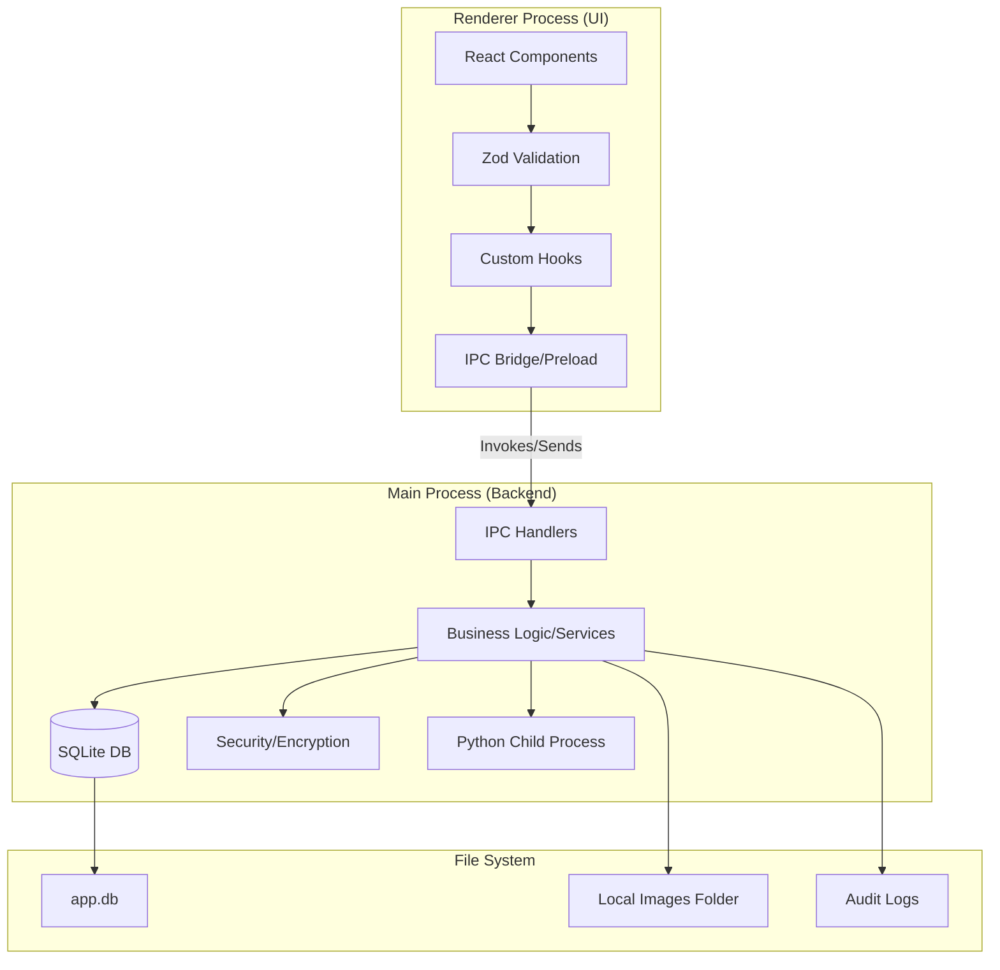

# 🚀 Planejamento de Migração: Laudo Pericial
### 🐍 Python/Streamlit ➔ ⚛️ Electron + React

Este documento detalha o roadmap estratégico para a migração do sistema "Laudo Pericial" para uma arquitetura desktop robusta. O planejamento é dividido em sprints incrementais, priorizando a fundação técnica e a segurança antes das funcionalidades de negócio.

Em caso de consulta do projeto em python + streamlit, acesse o diretorio laudo-streamlit na raiz deste projeto.

---

## 📋 Sumário
- [🔄 Ciclo de Vida e Estados](#-ciclo-de-vida-e-estados)
- [🛠️ Stack Tecnológico](#️-stack-tecnológico)
- [🏗️ Arquitetura e Estrutura](#️-arquitetura-e-estrutura)
- [🎨 Design System](#-design-system)
- [🖼️ Gestão de Imagens](#️-gestão-de-imagens)
- [📅 Roadmap de Sprints](#-roadmap-de-sprints)
    - [Sprint 0: Fundação & Segurança](#sprint-0-fundação-segurança-e-infraestrutura-crítica)
    - [Sprint 1: Arquitetura Base](#sprint-1-fundação-e-arquitetura-base)
    - [Sprint 2: Cadastros Estruturais](#sprint-2-perfil-do-perito-e-cadastros-estruturais-de-apoio-com-shadcnui)
    - [Sprint 3: Gestão de REPs](#sprint-3-gestão-de-requisições-rep-com-shadcnui)
    - [Sprint 4: Edição de Laudos](#sprint-4-núcleo-do-sistema---edição-de-laudos-com-imagens-e-legendas)
    - [Sprint 5: Placeholders](#sprint-5-motor-de-placeholders-e-dinamismo)
    - [Sprint 6: Assistência IA](#sprint-6-assistência-inteligente-ia---opcional-e-configurável)
    - [Sprint 7: Exportação](#sprint-7-exportação-e-documento-final)
    - [Sprint 8: Auditoria & Backup](#sprint-8-histórico-auditoria-e-backuprestauração)
    - [Sprint 9: Performance](#sprint-9-otimização-de-performance-e-experiência-do-usuário)
    - [Sprint 10: Distribuição](#sprint-10-utilidades-polimento-final-e-distribuição)

---

## 🔄 Ciclo de Vida e Estados
> [!NOTE]
> O ciclo de vida base governa as regras de transição de dados entre os módulos de requisição e laudo.

| Entidade | Status Disponíveis | Observação |
| :--- | :--- | :--- |
| **REP** | `Pendente`, `Em Andamento`, `Concluído` | Requisição de Exame Pericial |
| **Laudo** | `Em andamento`, `Concluído`, `Entregue` | "Nasce" como `Em andamento` ao vincular à REP |

---

## 🛠️ Stack Tecnológico

| Camada | Tecnologia | Descrição |
| :--- | :--- | :--- |
| **Runtime Desktop** | [Electron](https://www.electronjs.org/) | Container para aplicação desktop |
| **Build Tool** | [Vite](https://vitejs.dev/) | Bundler ultrarrápido com HMR |
| **Linguagem** | [TypeScript](https://www.typescriptlang.org/) | Tipagem estática para robustez |
| **Frontend** | [React](https://react.dev/) | Biblioteca de UI declarativa |
| **Backend (Main)** | [Node.js](https://nodejs.org/) | Processo principal do Electron |
| **Banco de Dados** | [SQLite](https://www.sqlite.org/) | Armazenamento local leve e confiável |
| **UI Components** | [Shadcn/ui](https://ui.shadcn.com/) | Componentes acessíveis com Tailwind CSS |
| **Editor Rich Text** | [TinyMCE](https://www.tinymce.com/) | Editor de texto robusto para laudos |
| **Validação** | [Zod](https://zod.dev/) + [React Hook Form](https://react-hook-form.com/) | Esquemas de dados e gestão de formulários |

---

## 🏗️ Arquitetura e Estrutura

### 🗺️ Fluxo de Comunicação (IPC)


### 📁 Estrutura de Diretórios
```text
projeto/
├── src/
│   ├── main/                    # Electron Main Process (Backend)
│   │   ├── database/            # SQLite, Prisma/TypeORM, Migrations
│   │   ├── ipc/                 # Handlers IPC (Comunicação Main-Renderer)
│   │   ├── security/            # Criptografia, Sanitização e Validação
│   │   ├── services/            # Regras de Negócio complexas
│   │   └── utils/               # Helpers globais
│   ├── preload/                 # Bridge IPC segura (Context Bridge)
│   ├── renderer/                # Frontend React
│   │   ├── components/          # Shadcn UI, Forms, Shared
│   │   ├── pages/               # Views principais da aplicação
│   │   ├── hooks/               # Custom hooks para lógica de UI
│   │   ├── lib/                 # Configurações e validadores Zod
│   │   └── styles/              # CSS Global e Tailwind config
│   └── shared/                  # Types, Interfaces e Constantes comuns
├── python/                      # Scripts Python legados para reutilização
├── public/                      # Assets e Armazenamento local de imagens
├── electron-builder.yml         # Configurações de empacotamento
└── vite.config.ts               # Build pipeline
```

---

## 🎨 Design System

> [!TIP]
> O uso do **Shadcn/ui** garante uma interface moderna e profissional ("Premium Design") com pouco esforço de estilo customizado.

### Componentes Chave:
- **Form/Input/Select**: Para cadastros técnicos rigorosos.
- **Table/Badge**: Para dashboard de REPs e status.
- **Dialog/AlertDialog**: Para confirmações críticas e inserção de imagens.
- **Tabs**: Para separar seções do laudo e configurações.

---

## 🖼️ Gestão de Imagens

### 📄 Modelo de Dados
```typescript
interface ImagemLaudo {
  id: string;
  laudo_id: string;
  caminho: string;                    // public/images/laudo_123_img_001.jpg
  legenda: string;                    // "Figura X: descrição"
  numero_figura: number;              // 1, 2, 3... (auto-incrementado)
  sequencia: number;                  // Ordem de exibição manual
  gps?: { latitude: number; longitude: number; };
  dataCaptura: Date;
}
```

### 🛠️ Fluxo de Inserção
1. **Manual (TinyMCE)**: Diálogo modal para upload + legenda instantânea.
2. **Automática (Side Panel)**: Painel com Cards, reordenação via Drag-and-Drop e geração automática de seção "Figuras" ao final.

---

## 📅 Roadmap de Sprints

### 🏗️ Sprint 0: Fundação, Segurança e Infraestrutura Crítica
**Objetivo:** Garantir a base sólida antes de qualquer interface funcional.

- [ ] Inicializar boilerplate Electron + Vite + TypeScript.
- [ ] Implementar **Criptografia** (bcrypt/crypto) e **Sanitização** de entradas.
- [ ] Configurar **SQLite** com suporte a migrations (Prisma recomendado).
- [ ] Sistema de **Logs rotativos** (max 5MB) para auditoria.
- [ ] Tela de **Recuperação de Erros** (fallback para o banco de dados).
- [ ] Configurar Shadcn/ui e Tailwind CSS.

---

### 🧱 Sprint 1: Fundação e Arquitetura Base
**Objetivo:** Estabelecer o "esqueleto" de comunicação do sistema.

- [ ] Validar schema inicial (Users, REPs, Laudos, Imagens, Logs).
- [ ] Estabelecer padrão de **IPC Tipado** para segurança total na comunicação.
- [ ] Implementar prepared statements contra SQL Injection.
- [ ] Criar handlers de "Health Check" do sistema.

---

### 👤 Sprint 2: Perfil do Perito e Apoio
**Objetivo:** Cadastros base para o funcionamento do fluxo.

- [ ] CRUD: **Perfil do Perito** (Criptografado).
- [ ] CRUD: **Solicitantes** (Órgãos/Varas/Delegacias).
- [ ] CRUD: **Tipos de Exame** e **Templates de Cabeçalho**.
- [ ] > [!IMPORTANT]
  > **Reuso Python:** Analisar scripts de processamento de templates para integração via `child_process`.

---

### 📋 Sprint 3: Gestão de Requisições (REP)
**Objetivo:** Fluxo de entrada de trabalho.

- [ ] Dashboard de REPs com **Shadcn/ui Table**.
- [ ] Filtros avançados e **Virtual Scrolling** para grandes volumes.
- [ ] Histórico de Auditoria de status da REP.
- [ ] Formulário de Nova REP integrado aos cadastros de apoio.

---

### 🖊️ Sprint 4: Núcleo - Edição de Laudos
**Objetivo:** O motor de escrita e gestão de evidências.

- [ ] Integração customizada do **TinyMCE**.
- [ ] Sistema de **Auto-save** (30s) e **Snapshots** (últimas 3 versões).
- [ ] Painel Lateral de Gestão de Imagens (Cards + Legendas).
- [ ] Drag-and-Drop para reordenação de figuras.
- [ ] Geração automática de seção "Figuras".

---

### 🔗 Sprint 5: Placeholders e Dinamismo
**Objetivo:** Automação de campos repetitivos.

- [ ] Interpretador de tags: `[NUMERO_REP]`, `[PERITO_NOME]`, etc.
- [ ] CRUD de **Placeholders Customizados**.
- [ ] Menu suspenso no editor para inserção rápida de tags.

---

### 🤖 Sprint 6: Assistência IA (Opcional)
**Objetivo:** Inteligência na escrita de laudos.

- [ ] Configuração de chaves de API (Groq/Gemini) com segurança.
- [ ] Painel de Assistente Pareado: "Corrigir", "Melhorar", "Resumir".
- [ ] Fallback: Ocultar funcionalidade se não houver chaves configuradas.

---

### 📄 Sprint 7: Exportação e Documento Final
**Objetivo:** Produção do laudo em formatos oficiais.

- [ ] Exportação Nativa: **PDF** (mantendo CSS e Imagens).
- [ ] Exportação Conversível: **DOCX** e **ODT**.
- [ ] Pré-visualização de Impressão (Print Preview).
- [ ] Metadados de documento e seção de figuras automática.

---

### 💾 Sprint 8: Auditoria, Backup e Nuvem
**Objetivo:** Segurança de dados e persistência a longo prazo.

- [ ] Log de Auditoria cronológico detalhado.
- [ ] **Ferramenta de Backup**: ZIP (SQLite + Pasta de Imagens).
- [ ] Preparação para Sync (Google Drive/OneDrive).

---

### ⚡ Sprint 9: Otimização e UX
**Objetivo:** Polimento de performance e interface.

- [ ] Indexação pesada no SQLite para busca instantânea.
- [ ] Lazy loading de imagens e componentes de editor.
- [ ] Feedback visual (Toasts, Spinners, Skeletons).
- [ ] **Atalhos de Teclado** customizados (Ctrl+S, etc).

---

### 📦 Sprint 10: Distribuição
**Objetivo:** Entrega do instalador final.

- [ ] Refinamento estético final (Theming Dark/Light).
- [ ] Empacotamento com **electron-builder** (.exe / portable).
- [ ] Implementação do **Auto-updater**.
- [ ] Geração de Manuais de Usuário consolidados.

---

> [!CAUTION]
> **Atenção:** Sempre consulte o projeto legado em Python/Streamlit para garantir a paridade das regras de negócio complexas, especialmente em cálculos e validações de tipos de exame específicos.
